# Reject Cycle Count System

## Description:

Reject Management Center Cycle count system where operators pick when to count (no fixed schedule). Min 3 months between customer counts.

### Workflow
- On-demand counting - pick any customer that is due
- Multiple customers at once
- Auto-saves everything (crash recovery built-in)
- Pause anytime, resume later
- Auto reminders depending on time

### The Flow:
0. **Main Page** - Picking progress (3 buttons)
1. **Generate Count** - Creating count for customers (checks 3-month rule)
2. **Cycle Count** - Start scanning pallets
3. **Bundle Scanning** - Scan bundles, pause if needed
4. **Pallet Check** - Verify completion, handle MTF/Scrap
5. **Discrepancy Rescan** - Fix any issues/Continue from checkpoint
6. **Documentation** - Reports & emails

---

## 0. Main Page Navigation

Navigation Menu
Generate Count - Start cycle by selecting customer and generating count id and list

Cycle count - Resume cycle count by scanning cycle id for customer

Discrepancy - Resolve discrepancy goes back to pallets marked with discrepancy, able to view replaced lots and initiate rescan/close pallet entirely with approval

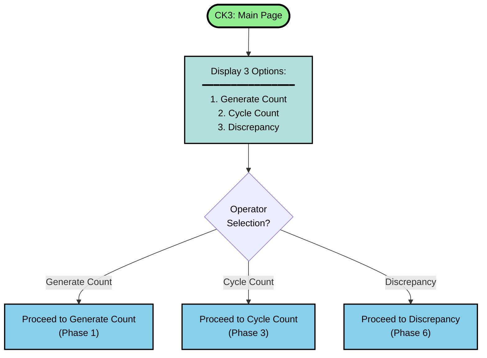

---

## 1. Generate Count (On-Demand)
Generation of customer cycle count (need to be within 3 mos. since last generation)

```mermaid
flowchart TB
    Start(["Start: Generate Count"]) --> n1["Operator: Scan Badge ID"]
    n1 --> n2["CK3: Display Customer Selection Screen<br>Show Available Customers with Last Cycle Date"]
    n2 --> n3["Operator: Select Customer/s<br>(Multiple Selection Allowed)"]
    n3 --> n4{"System: Check Last Cycle Date<br>for Each Selected Customer"}
    n4 -- &lt;3 Months Ago --> n5["CK3: Display Error<br>━━━━━━━━━━━━━━━━<br>Cannot Generate Cycle<br>Last cycle was less than 3 months ago<br>Last Cycle Date: [Date]<br>Next Available: [Date]"]
    n5 --> n2
    n4 -- ≥3 Months Ago --> n6["System: Generate Cycle Count List<br>Per Selected Customer/s"]
    n6 --> B1["Group Pallets by Customer"]
    B1 --> B1a["Sort Pallets by Age<br>Priority: Older Pallet Numbers First"]
    B1b["Select 5% Sample of Aging Pallets"] --> B1c["Select 5% Sample Bundles from Sampled Pallets"]
    B2["Create Cycle Count ID"] --> B3["Update Pallet and Bundle List<br>Record: Pallet - Lot - Bundle Location"]
    B3 --> C1["System: Send Email Cycle Count Generated<br>━━━━━━━━━━━━━━━━<br>To: RMC Team<br>Subject: Cycle Count Generated<br>Details: Count ID, Customer/s, List of Pallets/Bundles"]
    C1 --> C2["System: Activate Reminder Email<br>Weekly reminders, Daily for last week<br>Will send if cycle count remains active"]
    C2 --> n7["Email for remaining customers not checked within the year (Once every 3 months)"]
    B1a --> B1b
    B1c --> B2
    n7 --> Next["Cycle Count Generated Successfully<br>Return to Main Page"]

    style Start fill:#87CEEB,stroke:#000,stroke-width:3px,color:#000
    style n1 color:#000
    style n2 fill:#B2DFDB,stroke:#000,stroke-width:2px,color:#000
    style n3 color:#000
    style n4 color:#000
    style n5 fill:#FFB6C1,stroke:#000,stroke-width:2px,color:#000
    style n6 fill:#FFE4B5,stroke:#000,stroke-width:2px,color:#000
    style B1 color:#000
    style B1a color:#000
    style B1b color:#000
    style B1c color:#000
    style B2 color:#000
    style B3 color:#000
    style C1 fill:#FFE4B5,stroke:#000,stroke-width:2px,color:#000
    style C2 fill:#FFE4B5,stroke:#000,stroke-width:2px,color:#000
    style Next fill:#90EE90,stroke:#000,stroke-width:3px,color:#000




```

---

## 2. Cycle Count - Primary Count Execution

Initialising count, finding pallet and verifying

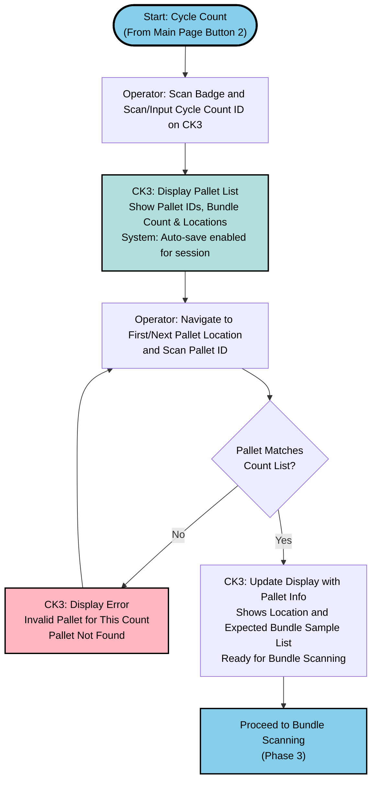

---

## 3. Bundle Scanning & Pause/Resume

Start bundle scanning process flow with cross checking and handling of different scenarios

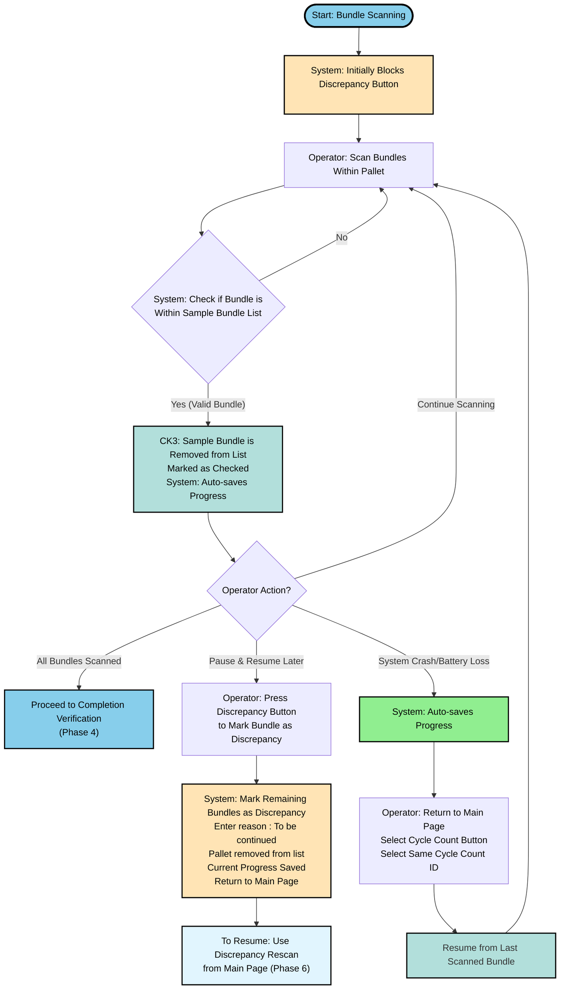

---

## 4. Pallet Completion Verification

All Sample bundles checked and verified

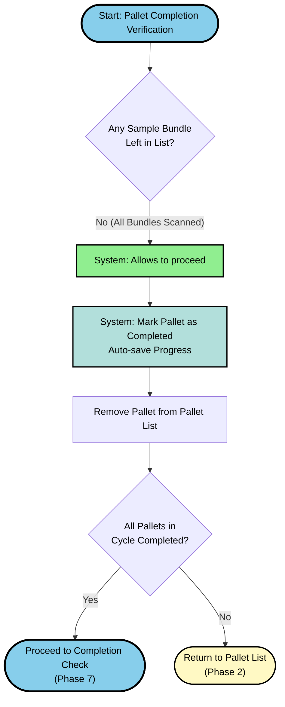
Sample bundles unchecked -> Discrepancy logging
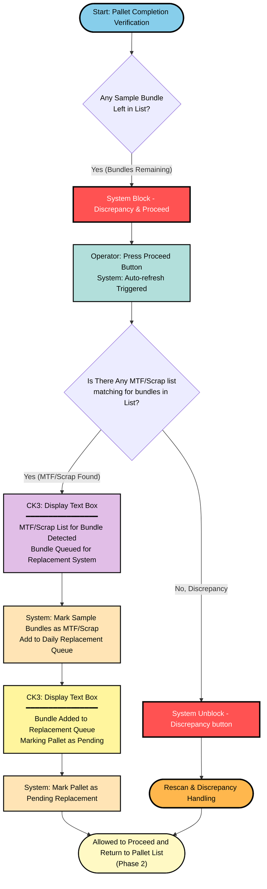
Rescan/File discrepancy for bundles not found (need supervisor badge)
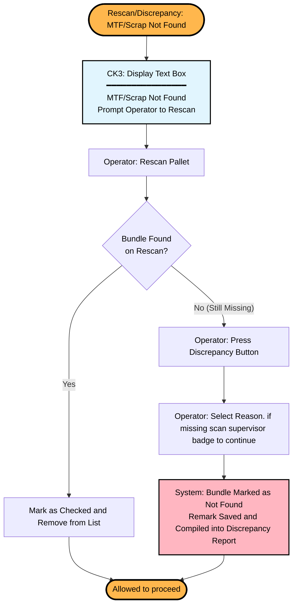
Replacement system scheduled to run each day for replacing MTF and bundles confirmed to be not found
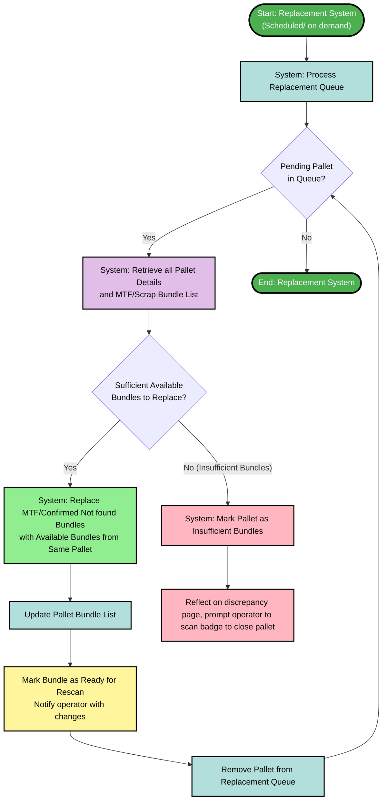

---

## 5. Discrepancy Resolve

Handling discrepancy/ Resuming paused pallets

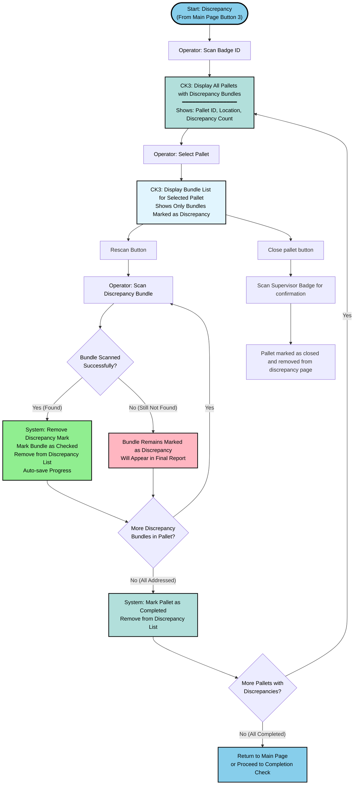

---

## 6. Completion & Coverage Check

System generates summary and sends emails.

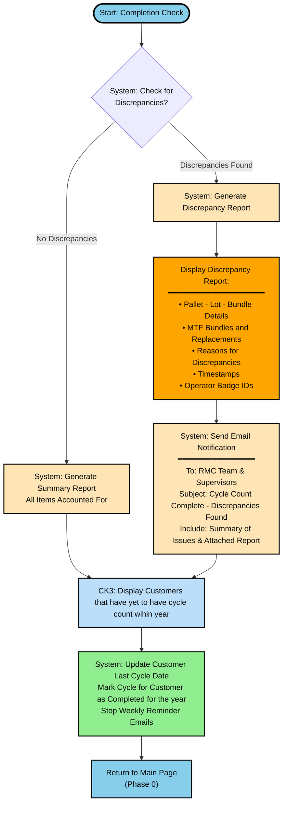

---

## Pallet picking logic

System auto-refreshes sample lists when scrap lists get generated.

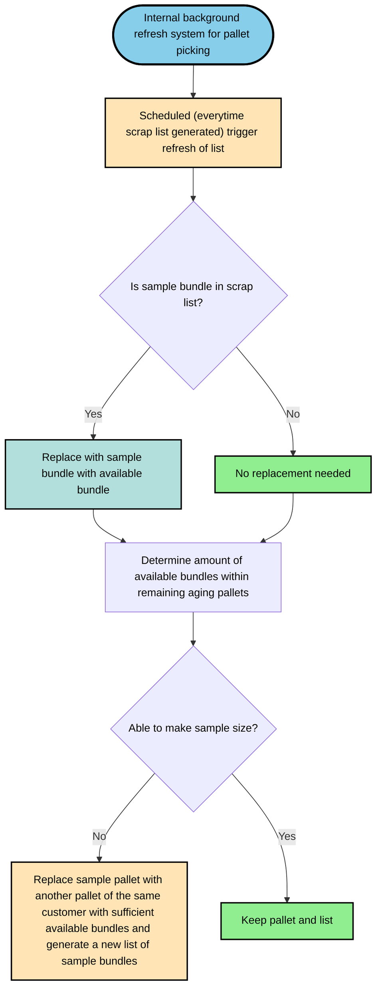

---

## Email Notifications

The system sends these emails automatically:

### Type 1: Cycle Count Generated
**When:** New cycle count created (Phase 1)  
**To:** RMC Team  
**Contains:**
- Cycle Count ID
- Customer(s) selected
- Pallet lists
- Generation date & operator badge

### Type 2: Weekly Reminders after activation
**When:** Every week while count is active (daily in final week)  
**To:** RMC Team & Supervisors  
**Contains:**
- Cycle Count ID
- Customer(s)
- Days until due date
- Date when count started
- Current progress (%)
- **Stops:** When cycle completed (Phase 6)

### Type 3: Customers Not Checked (Every 3 Months)
**When:** Every 3 Months
**To:** RMC Team & Management  
**Contains:**
- Customers not checked within the year
- Last cycle dates

### Type 4: Completion summary
**When:** Cycle done (Phase 6)  
**To:** RMC Team & Supervisors  
**Contains:**
- Full discrepancy report if any
- Issue summary
- Total discrepancy count if any
- MTF/Scrap bundle counts

---

## Process Flow Summary

```
Phase 0: Main Page
    ├─ Button 1 → Phase 1: Generate Count
    │              └─ Back to Main Page
    │
    ├─ Button 2 → Phase 2: Start Counting
    │              ↓
    │              Phase 3: Scan Bundles
    │              ↓ (pause → Phase 5 or crash recovery)
    │              ↓
    │              Phase 4: Check Pallet
    │              ↓ (loops to Phase 2 if more pallets)
    │              ↓
    │              Phase 6: Finish
    │              └─ Back to Main Page
    │
    └─ Button 3 → Phase 5: Fix Discrepancies
                   └─ Back to Phase 6 or Main Page


```

---

## Color Legend

What the colors mean in the flowcharts:

- Green (#90EE90) - Success/completion
- Blue (#87CEEB) - Phase transitions, start/end
- Yellow (#FFE4B5) - System operations (auto-save, emails, scheduling)
- Orange (#FFA500) - Notifications (discrepancies, MTF alerts, missing items)
- Pink (#FFB6C1) - Errors/needs attention (discrepancy logs, error messages)
- Red (#FF5252) - System blocks prevention of progressing
- Purple (#E1BEE7) - MTF-related
- Light Blue (#E1F5FE) - Info displays (rescan ops, summaries)
- Teal (#B2DFDB) - Updates happening (saving progress, updating lists, replacements)
