# Reject Cycle Count System - Flowcharts

## Overview

This flexible, on-demand cycle count system allows operators to generate and execute cycle counts based on workload availability, rather than fixed monthly schedules.

### Key Features:
- **On-Demand Generation**: Operators can select any customer(s) for cycle counting (minimum 3 months since last count)
- **Multi-Customer Selection**: Generate counts for multiple customers simultaneously
- **Auto-Save & Recovery**: System automatically saves progress for crash/battery loss recovery
- **Pause & Resume**: Operators can pause mid-scan and resume later via Discrepancy Rescan
- **Flexible Workflow**: 3 main entry points from main page for different operational needs
- **Automated Notifications**: Weekly reminders and coverage alerts keep team informed

### System Phases:
0. **Main Page Navigation** - Central hub with 3 operational buttons
1. **Generate Count (On-Demand)** - Create cycle counts for selected customers with 3-month validation
2. **Cycle Count - Primary Count Execution** - Access and begin counting pallets
3. **Bundle Scanning & Pause/Resume** - Scan bundles with pause/resume capability and crash recovery
4. **Pallet Completion Verification** - Validate completeness with auto-refresh and MTF/Scrap handling
5. **Discrepancy Rescan** - Address bundles marked as discrepancies
6. **Completion & Coverage Check** - Generate reports and close cycle counts

---

## 0. Main Page Navigation

```mermaid
flowchart TD
    Start(["CK3: Main Page"]) --> Main["Display 3 Options:<br>━━━━━━━━━━━━━━━━<br>1. Generate Count<br>2. Cycle Count<br>3. Discrepancy Rescan"]
    Main --> Choice{"Operator<br>Selection?"}
    Choice -- "1. Generate Count" --> Gen["Proceed to Generate Count<br>(Phase 1)"]
    Choice -- "2. Cycle Count" --> CC["Proceed to Cycle Count<br>(Phase 3)"]
    Choice -- "3. Discrepancy Rescan" --> DR["Proceed to Discrepancy Rescan<br>(Phase 6)"]

    style Start fill:#90EE90,stroke:#000,stroke-width:3px,color:#000
    style Main fill:#B2DFDB,stroke:#000,stroke-width:2px,color:#000
    style Choice color:#000
    style Gen fill:#87CEEB,stroke:#000,stroke-width:2px,color:#000
    style CC fill:#87CEEB,stroke:#000,stroke-width:2px,color:#000
    style DR fill:#87CEEB,stroke:#000,stroke-width:2px,color:#000
```



---

## 1. Generate Count (On-Demand)

```mermaid
flowchart TD
    Start(["Start: Generate Count"]) --> n1["Operator: Scan Badge ID"]
    n1 --> n2["CK3: Display Customer Selection Screen<br>Show Available Customers with Last Cycle Date"]
    n2 --> n3["Operator: Select Customer/s<br>(Multiple Selection Allowed)"]
    n3 --> n4{"System: Check Last Cycle Date<br>for Each Selected Customer"}
    n4 -- "<3 Months Ago" --> n5["CK3: Display Error<br>━━━━━━━━━━━━━━━━<br>Cannot Generate Cycle<br>Last cycle was less than 3 months ago<br>Last Cycle Date: [Date]<br>Next Available: [Date]"]
    n5 --> n2
    n4 -- "≥3 Months Ago" --> n6["System: Generate Cycle Count List<br>Per Selected Customer/s"]
    n6 --> B1["Group Pallets by Customer"]
    B1 --> B1a["Sort Pallets by Age<br>Priority: Older Pallet Numbers First"]
    B1a --> n7["Filter pallets that have sufficient available bundles"]
    n7 --> B1b["Select 5% Sample of Aging Pallets"]
    B1b --> B1c["Select Sample Bundles from Sampled Pallets"]
    B1c --> n8["Internal background refresh system"]
    n8 --> B2["Create Cycle Count ID"]
    B2 --> B3["Update Pallet and Bundle List in Database<br>Status: Pending<br>Record: Pallet - Lot - Bundle Location"]
    B3 --> C1["System: Send Email Type 1<br>━━━━━━━━━━━━━━━━<br>To: RMC Team<br>Subject: Cycle Count Generated<br>Details: Count ID, Customer/s, List of Pallets/Bundles"]
    C1 --> C2["System: Activate Weekly Reminder Email<br>Will send if cycle count remains active"]
    C2 --> Next["Cycle Count Generated Successfully<br>Return to Main Page"]

    n8@{ shape: rect}
    n7@{ shape: rect}
    style Start fill:#87CEEB,stroke:#000,stroke-width:3px,color:#000
    style n1 color:#000
    style n2 fill:#B2DFDB,stroke:#000,stroke-width:2px,color:#000
    style n3 color:#000
    style n4 color:#000
    style n5 fill:#FFB6C1,stroke:#000,stroke-width:2px,color:#000
    style n6 fill:#FFE4B5,stroke:#000,stroke-width:2px,color:#000
    style B1 color:#000
    style B1a color:#000
    style n7 fill:#FFE4B5,stroke:#000,stroke-width:2px,color:#000
    style B1b color:#000
    style B1c color:#000
    style n8 fill:#FFE4B5,stroke:#000,stroke-width:2px,color:#000
    style B2 color:#000
    style B3 color:#000
    style C1 fill:#FFE4B5,stroke:#000,stroke-width:2px,color:#000
    style C2 fill:#FFE4B5,stroke:#000,stroke-width:2px,color:#000
    style Next fill:#90EE90,stroke:#000,stroke-width:3px,color:#000

```



---

## 2. Cycle Count - Primary Count Execution


---

## 3. Bundle Scanning & Pause/Resume


---

## 4. Pallet Completion Verification

```mermaid
flowchart TD
    Start(["Start: Pallet Completion Verification"]) --> n1{"Any Sample Bundle<br>Left in List?"}
    n1 -- "No (All Bundles Scanned)" --> n16["System Unblocks Navigation"]
    n1 -- "Yes (Bundles Remaining)" --> n15["System Block - Unable to Proceed"]
    n15 --> n2["Operator: Press Back/Proceed Button<br>System: Auto-refresh Triggered"]
    n2 --> n3{"Is There Any MTF/Scrap list<br>matching for bundles in List?"}
    n3 -- "Yes (MTF/Scrap Found)" --> n4["CK3: Display Text Box<br>━━━━━━━━━━━━━━━━<br>MTF/Scrap List for Bundle Detected<br>Refreshing Bundles"]
    n4 --> n5["System: Mark Sample Bundles as MTF/Scrap<br>Attempt to Replace with Different Bundle<br>Within Same Pallet"]
    n5 --> n22{"Sufficient Available<br>Bundles to Replace?"}
    n22 -- "Yes" --> n6["CK3: Update List with Different Bundles<br>from the Same Pallet"]
    n6 --> n9["Operator: Rescan Pallet"]
    n22 -- "No (Insufficient Bundles)" --> n23["CK3: Display Error<br>━━━━━━━━━━━━━━━━<br>Not Enough Available Bundles<br>to Replace MTF/Scrap Bundles<br>Marking Pallet as Completed"]
    n23 --> n16
    n3 -- "No (No MTF/Scrap)" --> n8["CK3: Display Text Box<br>━━━━━━━━━━━━━━━━<br>MTF/Scrap Not Found<br>Prompt Operator to Rescan"]
    n8 --> n9
    n9 --> n10{"Bundle Found<br>on Rescan?"}
    n10 -- "Yes" --> n12["Mark as Checked and Remove from List"]
    n12 --> n1
    n10 -- "No (Still Missing)" --> n11["Operator: Press Discrepancy Button"]
    n11 --> n13["Operator: Scan Badge ID and Select Reason"]
    n13 --> n14["System: Bundle Marked as Discrepancy<br>Remark Saved and Compiled into Discrepancy Report"]
    n14 --> n1
    n16 --> n17["System: Mark Pallet as Completed<br>Auto-save Progress"]
    n17 --> n21["Remove Pallet from Pallet List"]
    n21 --> n18{"All Pallets in<br>Cycle Completed?"}
    n18 -- "Yes" --> n19(["Proceed to Completion Check<br>(Phase 7)"])
    n18 -- "No" --> n20(["Return to Pallet List<br>(Phase 2)"])

    style Start fill:#87CEEB,stroke:#000,stroke-width:3px,color:#000
    style n1 color:#000
    style n16 fill:#90EE90,stroke:#000,stroke-width:2px,color:#000
    style n15 fill:#FF5252,stroke:#000,stroke-width:3px,color:#FFF
    style n2 fill:#B2DFDB,stroke:#000,stroke-width:2px,color:#000
    style n3 color:#000
    style n4 fill:#E1BEE7,stroke:#000,stroke-width:2px,color:#000
    style n5 fill:#FFE4B5,stroke:#000,stroke-width:2px,color:#000
    style n22 color:#000
    style n6 fill:#B2DFDB,stroke:#000,stroke-width:2px,color:#000
    style n23 fill:#FFB6C1,stroke:#000,stroke-width:2px,color:#000
    style n9 color:#000
    style n8 fill:#E1F5FE,stroke:#000,stroke-width:2px,color:#000
    style n10 color:#000
    style n12 color:#000
    style n11 color:#000
    style n13 color:#000
    style n14 fill:#FFB6C1,stroke:#000,stroke-width:2px,color:#000
    style n17 fill:#B2DFDB,stroke:#000,stroke-width:2px,color:#000
    style n21 color:#000
    style n18 color:#000
    style n19 fill:#87CEEB,stroke:#000,stroke-width:3px,color:#000
    style n20 fill:#FFF9C4,stroke:#000,stroke-width:2px,color:#000
```



---

## 5. Discrepancy Rescan

```mermaid
flowchart TD
    Start(["Start: Discrepancy Rescan<br>(From Main Page Button 3)"]) --> n1["Operator: Scan Badge ID"]
    n1 --> n2["CK3: Display All Pallets with Discrepancy Bundles<br>━━━━━━━━━━━━━━━━<br>Shows: Pallet ID, Location, Discrepancy Count"]
    n2 --> n3["Operator: Select Pallet to Rescan"]
    n3 --> n4["CK3: Display Bundle List for Selected Pallet<br>Shows Only Bundles Marked as Discrepancy"]
    n4 --> n5["Operator: Scan Discrepancy Bundle"]
    n5 --> n6{"Bundle Scanned<br>Successfully?"}
    n6 -- "Yes (Found)" --> n7["System: Remove Discrepancy Mark<br>Mark Bundle as Checked<br>Remove from Discrepancy List<br>Auto-save Progress"]
    n6 -- "No (Still Not Found)" --> n8["Bundle Remains Marked as Discrepancy<br>Will Appear in Final Report"]
    n7 --> n9{"More Discrepancy<br>Bundles in Pallet?"}
    n8 --> n9
    n9 -- "Yes" --> n5
    n9 -- "No (All Addressed)" --> n10["System: Mark Pallet as Completed<br>Remove from Discrepancy List"]
    n10 --> n11{"More Pallets with<br>Discrepancies?"}
    n11 -- "Yes" --> n2
    n11 -- "No (All Completed)" --> n12["Return to Main Page<br>or Proceed to Completion Check"]

    style Start fill:#87CEEB,stroke:#000,stroke-width:3px,color:#000
    style n1 color:#000
    style n2 fill:#B2DFDB,stroke:#000,stroke-width:2px,color:#000
    style n3 color:#000
    style n4 fill:#E1F5FE,stroke:#000,stroke-width:2px,color:#000
    style n5 color:#000
    style n6 color:#000
    style n7 fill:#90EE90,stroke:#000,stroke-width:2px,color:#000
    style n8 fill:#FFB6C1,stroke:#000,stroke-width:2px,color:#000
    style n9 color:#000
    style n10 fill:#B2DFDB,stroke:#000,stroke-width:2px,color:#000
    style n11 color:#000
    style n12 fill:#87CEEB,stroke:#000,stroke-width:2px,color:#000
```



---

## 6. Completion & Coverage Check

```mermaid
flowchart TD
    Start(["Start: Completion Check"]) --> DC1{"System: Check for<br>Discrepancies?"}
    DC1 -- "Discrepancies Found" --> DC2["System: Generate Discrepancy Report"]
    DC2 --> DC3["Display Discrepancy Report:<br>━━━━━━━━━━━━━━━━━━━━<br>• Pallet - Lot - Bundle Details<br>• MTF Bundles and Replacements<br>• Reasons for Discrepancies<br>• Timestamps<br>• Operator Badge IDs"]
    DC3 --> DC4["System: Send Email Notification<br>━━━━━━━━━━━━━━━━<br>To: RMC Team &amp; Supervisors<br>Subject: Cycle Count Complete - Discrepancies Found<br>Include: Summary of Issues &amp; Attached Report"]
    DC4 --> n1{"Operator: Review<br>Discrepancy List?"}
    n1 -- "Yes, Rescan Discrepancies" --> n2["Go to Discrepancy Rescan<br>(Phase 5)"]
    n1 -- "No, Finalize Report" --> DC5["CK3: Display Final Summary<br>━━━━━━━━━━━━━━━━━━━━<br>✓ Total Pallets Counted: [count]<br>✓ Total Bundles Scanned: [count]<br>⚠ Discrepancies Found: [count]<br>⚠ MTF Bundles: [count]<br>⚠ Scrap List Bundles: [count]<br>━━━━━━━━━━━━━━━━━━━━<br>Report Generated &amp; Emailed"]
    DC1 -- "No Discrepancies" --> ND1["System: Generate Summary Report<br>All Items Accounted For"]
    ND1 --> DC5
    DC5 --> NEXT2["System: Update Customer Last Cycle Date<br>Mark Cycle as Completed<br>Stop Weekly Reminder Emails"]
    NEXT2 --> Restart["Return to Main Page<br>(Phase 0)"]
    n2 --> n3["After Rescanning: Return to Completion Check"]
    n3 --> DC1

    style Start fill:#87CEEB,stroke:#000,stroke-width:3px,color:#000
    style DC1 color:#000
    style DC2 fill:#FFE4B5,stroke:#000,stroke-width:2px,color:#000
    style DC3 fill:#FFA500,stroke:#000,stroke-width:2px,color:#000
    style DC4 fill:#FFE4B5,stroke:#000,stroke-width:2px,color:#000
    style n1 color:#000
    style n2 fill:#E1F5FE,stroke:#000,stroke-width:2px,color:#000
    style n3 fill:#B2DFDB,stroke:#000,stroke-width:2px,color:#000
    style DC5 fill:#BBDEFB,stroke:#000,stroke-width:2px,color:#000
    style ND1 fill:#FFE4B5,stroke:#000,stroke-width:2px,color:#000
    style NEXT2 fill:#90EE90,stroke:#000,stroke-width:2px,color:#000
    style Restart fill:#87CEEB,stroke:#000,stroke-width:2px,color:#000

```



---

## Internal background refresh


---

## Email Notification System

The system sends 2 types of automated emails:

### **Email Type 1: Cycle Count Generated**
- **Trigger**: When a new cycle count is generated (Phase 1)
- **Recipients**: RMC Team
- **Subject**: Cycle Count Generated
- **Content**:
  - Cycle Count ID
  - Customer name(s) selected
  - List of pallets and bundles to check
  - Generation date and operator badge ID

### **Email Type 2: Weekly Reminder (Conditional)**
- **Trigger**: Every week while a cycle count remains active (not completed)
- **Recipients**: RMC Team & Supervisors
- **Subject**: Cycle Count Reminder - Action Required
- **Content**:
  - Cycle Count ID
  - Customer name(s)
  - Days since cycle was generated
  - Current status (% of pallets completed)
  - Reminder to complete the count
- **Stop Condition**: Automatically stops when cycle is marked as completed (Phase 6)

### **Email Type 3: Customers Not Checked Alert**
- **Trigger**: Configurable schedule (e.g., monthly or quarterly)
- **Recipients**: RMC Team & Management
- **Subject**: Cycle Count Coverage Alert
- **Content**:
  - List of customers who haven't been cycle counted yet
  - Last cycle date for each customer
  - Customers approaching or past the 3-month threshold
  - Recommended action items

### **Email Type 4: Completion with Discrepancies**
- **Trigger**: When cycle count is completed with discrepancies (Phase 6)
- **Recipients**: RMC Team & Supervisors
- **Subject**: Cycle Count Complete - Discrepancies Found
- **Content**:
  - Discrepancy report attached
  - Summary of issues found
  - Total discrepancy count
  - MTF/Scrap bundle counts

---

## Process Flow Summary

```
Phase 0: Main Page Navigation
    ├─ Option 1 → Phase 1: Generate Count (On-Demand)
    │              └─ Returns to Main Page after generation
    │
    ├─ Option 2 → Phase 2: Cycle Count - Primary Count Execution
    │              ↓
    │              Phase 3: Bundle Scanning & Pause/Resume
    │              ↓ (can pause → Phase 5: Discrepancy Rescan)
    │              ↓ (can crash/resume → auto-save/restore)
    │              ↓
    │              Phase 4: Pallet Completion Verification
    │              ↓ (loops back to Phase 2 if more pallets)
    │              ↓ (when all pallets counted)
    │              Phase 6: Completion & Coverage Check
    │              ↓ (may go to Phase 5 for discrepancy rescan)
    │              └─ Returns to Main Page (Phase 0)
    │
    └─ Option 3 → Phase 5: Discrepancy Rescan
                   └─ Can return to Phase 6 or Main Page

Workflow is flexible and on-demand:
- Operators can generate counts for any customer (>3 months since last)
- Multiple customers can be selected at once
- Progress auto-saves for crash recovery
- Discrepancies can be rescanned at any time
```

---

## Color Legend

- 🟢 **Green (#90EE90)**: Success/Completion states
- 🔵 **Blue (#87CEEB)**: Transition/Connection points between phases, Start/End nodes
- 🟡 **Yellow (#FFE4B5)**: System automated actions (scheduling, notifications, save functions, data generation)
- 🟠 **Orange (#FFA500)**: Warnings (discrepancies, MTF alerts, missing items)
- 🔴 **Pink (#FFB6C1)**: Errors/Flags requiring attention (discrepancy logging, error messages)
- 🔴 **Red (#FF5252)**: Critical System Block (requires supervisor override)
- 🟣 **Purple (#E1BEE7)**: MTF-related actions (MTF bundle display and handling)
- 🔷 **Light Blue (#E1F5FE)**: Information display (rescan operations, summary displays)
- 🟦 **Teal/Cyan (#B2DFDB)**: Refresh/Update actions (save progress, update lists, replacements)
