# Reject Cycle Count System - Flowcharts

## Overview
This system is broken down into 5 main phases for better readability:
1. **System Initialization & Scheduling**
2. **Primary Count Execution**
3. **Bundle Scanning**
4. **Pallet Completion Verification**
5. **Completion & Coverage Check**

---

## 1. System Initialization & Scheduling


---

## 2. Primary Count Execution


---

## 3. Bundle Scanning 


---

## 4. Pallet Completion Verification


---

## 5. Completion & Coverage Check

```mermaid
flowchart TD
    Start(["Start: Completion Check"]) --> DC1{"System: Check for<br>Discrepancies?"}
    DC1 -- Discrepancies Found --> DC2["System: Generate Discrepancy Report"]
    DC2 --> DC3["Display Discrepancy Report:<br>━━━━━━━━━━━━━━━━━━━━<br>• Pallet - Lot - Bundle Details<br>• MTF Bundles and Replacements<br>• Reasons for Discrepancies<br>• Timestamps"]
    DC3 --> DC4["System: Send Email Notification<br>To: RMC Team &amp; Supervisors<br>Subject: Cycle Count Complete - Discrepancies Found<br>Include: Summary of Issues"] & n1["View Discrepancy List"]
    DC4 --> DC5["CK3: Display Final Summary<br>━━━━━━━━━━━━━━━━━━━━<br>Completion Rate (Current Cycle): [%]<br>Completion Rate (Total Cycles): [%]<br>✓ Total Pallets Counted: [count]<br>✓ Total Bundles Scanned: [count]<br>⚠ Discrepancies Found: [count]<br>⚠ MTF Bundles: [count]<br>⚠ Scrap list Bundles: [count]<br>Report Generated &amp; Emailed"]
    DC1 -- No Discrepancies --> ND1["System: Generate Summary Report<br>All Items Accounted For"]
    NEXT2["CK3: Display Next Cycle Information<br>━━━━━━━━━━━━━━━━━━━━<br><br>Date of Next Cycle for current customer: [1 year/6 months from now]<br><br>"] --> Restart["Return to System Initialization<br>(Phase 1)"]
    ND1 --> DC5
    DC5 --> NEXT2
    n1 --> n2["CK3: Scan bundle with discrepancy to remove discepancy and mark as completed"]
    Restart --> n3["End"]
    n2 -- Update --> DC5

    style Start fill:#87CEEB,stroke:#000,stroke-width:3px,color:#000
    style DC1 color:#000
    style DC2 fill:#FFE4B5,stroke:#000,stroke-width:2px,color:#000
    style DC3 fill:#FFA500,stroke:#000,stroke-width:2px,color:#000
    style DC4 fill:#FFE4B5,stroke:#000,stroke-width:2px,color:#000
    style n1 fill:#E1F5FE,stroke:#000,stroke-width:2px,color:#000
    style DC5 fill:#BBDEFB,stroke:#000,stroke-width:2px,color:#000
    style ND1 fill:#FFE4B5,stroke:#000,stroke-width:2px,color:#000
    style NEXT2 fill:#E1F5FE,stroke:#000,stroke-width:2px,color:#000
    style Restart fill:#87CEEB,stroke:#000,stroke-width:2px,color:#000
    style n2 color:#000
    style n3 fill:#90EE90,stroke:#000,stroke-width:3px,color:#000



```



---

## Internal background refresh


---

## Process Flow Summary

```
Phase 1: Initialization & Scheduling
    ↓
Phase 2: Primary Count Execution
    ↓
Phase 3: Bundle Scanning
    ↓
Phase 4: Pallet Completion Verification
    ↓ (loops back to Phase 2 if more pallets)
    ↓ (when all pallets counted)
Phase 5: Completion & Coverage Check
    ↓ (if incomplete coverage)
    ↓ loops back to Phase 1
    ↓ (if complete)
    END
```

---

## Color Legend

- 🟢 **Green (#90EE90)**: Success/Completion states
- 🔵 **Blue (#87CEEB)**: Transition/Connection points between phases, Start/End nodes
- 🟡 **Yellow (#FFE4B5)**: System automated actions (scheduling, notifications, save functions, data generation)
- 🟠 **Orange (#FFA500)**: Warnings (discrepancies, MTF alerts, missing items)
- 🔴 **Pink (#FFB6C1)**: Errors/Flags requiring attention (discrepancy logging, error messages)
- 🔴 **Red (#FF5252)**: Critical System Block (requires supervisor override)
- 🟣 **Purple (#E1BEE7)**: MTF-related actions (MTF bundle display and handling)
- 🔷 **Light Blue (#E1F5FE)**: Information display (rescan operations, summary displays)
- 🟦 **Teal/Cyan (#B2DFDB)**: Refresh/Update actions (save progress, update lists, replacements)
